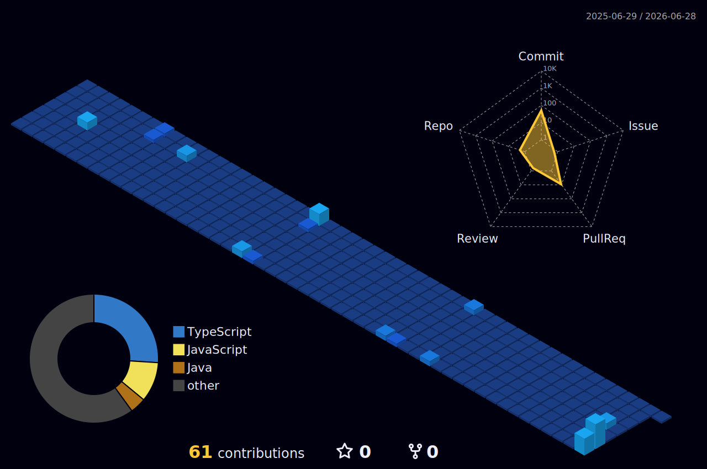

<!-- HERO -->

  <h2 style="margin-bottom: 10px;">
    
  </h2>  

 

<!-- SOCIALS -->

  
  
  
  
  

 

Business degree → bootcamp → Computer Science degree.  
I took the long route into software engineering, which shaped how I think about full-stack systems and machine learning.

Currently, I’m the Software Lead for Brock Formula SAE, building systems that support engineering workflows and performance.

Outside of development, I spend time in the gym or working on cars — usually so my brain doesn't fry from staring at a screen all day.

 

<!-- TECH STACK -->

## ⚙️ Tech Stack

### 🌎 Languages

  
  
  
  
  
  
  
  
  
  
  
  
  
  
  
  
  

### 👷‍♂️ Frameworks

  
  
  
  
  
  
  
  
  
  
  
  
  
  
  
  
  

### 🛠️ Dev tools

  
  
  
  
  
  
  
  
  
  
  

### 📚 Libraries

  
  
  
  
  
  
  

---

 

<!-- PROJECTS -->

## 🚀 Projects

| Project | Stack | Description |
|--------|------|-------------|
| 🏎 Formula SAE Platform | Next.js | Engineering team platform for Brock Racing 
| 🧭 Brock Campus Navigation | React Native • Node.js | Navigation Application For Brock University 
| 🧠 Road Hazard Detection | Python • Yolov8 • Flask | Neural network + ML navigation app 
| 📱 RentSwipe | Next.js • React Native | Rental app that connects landlords and tenants one swipe at a time
| 📈 Momentum | React • Node.js |Calorie Tracker that uses recipes instead of individual ingredients making tracking easier to do and easier to stick to 
| ☕ Coffee Shop System | Next.js • PostgreSQL • Stripe | Full-stack ordering + payments system 

---

 

<!-- SHOWCASE -->

# 📈 Showcase

<i>A few projects I've built.</i>

 

## 💻 Web Projects

<table>
<tr>
<td align="center" width="100%">

### 🚧 Road Hazard Detection

Computer vision system for detecting road hazards in real time and finding the best route.

</td>

</table>

 

## 📱 Mobile Projects

<table>
<tr>

<td align="center">

### 🧭 Brock Campus Navigation

Indoor campus navigation app.

</td>

<td align="center">

### 📈 Momentum

Fitness & nutrition application.

</td>

</tr>
</table>

---

 

<!-- ROADMAP -->

<h1>🚀 Roadmap</h1>

<i>Projects and features currently under active development.</i>

---

## 🛣️ Road Hazard Detection 

- [ ] Expand and rebalance the training dataset to improve hazard detection accuracy.
- [ ] Improve model reliability across a wider range of road conditions.
- [ ] Refine route generation to eliminate dead-end paths caused by waypoint selection.
- [ ] Continue optimizing inference performance for real-time navigation.

---

## 📱 Brock Campus Navigation

- [ ] Prepare the application for App Store release.
- [ ] Improve indoor navigation accuracy and campus coverage.
- [ ] Continue refining routing and user experience.

---

## 💪 Momentum

- [ ] Complete a premium redesign with a cleaner, more modern interface.
- [ ] Integrate an AI coach to:
  - Encourage users to stay consistent.
  - Generate personalized workout plans.
  - Recommend nutrition plans based on user goals.
- [ ] Build a proprietary nutrition database for more accurate macro and calorie tracking.
- [ ] Compare nearby grocery stores to recommend the most affordable ingredients for meal plans.

---

## 🐶 Pet Care Platform

- [ ] Real-time messaging between clients and pet care providers.
- [ ] Online booking and scheduling.
- [ ] Client approval workflow for new customers.
- [ ] Business management dashboard for availability, bookings, and services.
- [ ] Appointment reminders and booking notifications.

---

## 🚀 Current Direction

Right now I’m focused on:
- Deploying ML systems into real-time applications
- Improving performance and reliability of navigation tools
- Building production-grade full-stack systems with React/React-Native + Node.js + Supabase

 

<!-- STATS -->

## 📊 GitHub Stats

  

    
    
  

     
  
 
    
    
  

     
  

    
  

     
    
     
  

 

<picture data-importer="pacman">
  <source media="(prefers-color-scheme: dark)" srcset="https://raw.githubusercontent.com/adrienbelcastro/adrienbelcastro/pacman-output/galaga-contribution-graph-dark.svg?game=galaga">
  <source media="(prefers-color-scheme: light)" srcset="https://raw.githubusercontent.com/adrienbelcastro/adrienbelcastro/pacman-output/galaga-contribution-graph.svg?game=galaga">
  
</picture>
